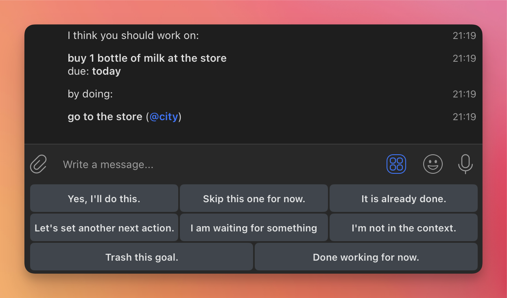

# Done Bot for Telegram

This is the source code for an incomplete project of mine. It's a Telegram bot that helps you do Getting Things Done. See [doc.md](doc.md) for a brief manual.

## Requirements

The bot is writtein in Go. It uses PostgreSQL for storage. You also need a bot token from Telegram. That's about it.

## Setup

You could host this literally anywhere, including running it from your local machine. Hosting on a world-accessible server with a webhook URL brings better performance, but is not essential.

- `BOT_TOKEN` - token provided by Telegram ([how to obtain it](https://core.telegram.org/bots#how-do-i-create-a-bot)).
- `DATABASE_URL` - PostgreSQL database URL
- set `WEBHOOK_URL` to the root URL of your server, if it is publically accessible.
- set `DEBUG=true` and `BOT_DEBUG=true` to see more logging.

Then run `make` and that's it - you can now interact with the bot through Telegram.

## Permitted use of this source code

I've abandoned the project, so the source is up for grabs! In fact I'd love to see it brought to completion. Perhaps the dialog system could be used for something else, like a game?

---

&copy; 2017-2025 [Leonid Shevtsov](https://leonid.shevtsov.me)
